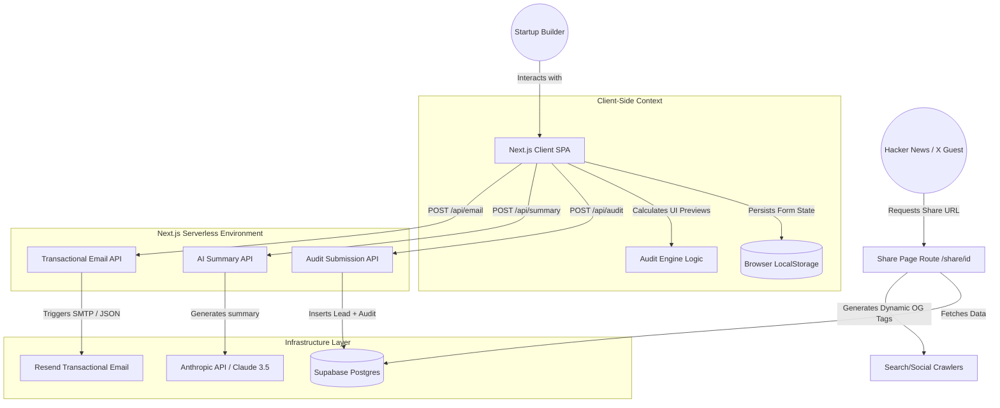

# System Architecture - SpendSentry

This document details the software architecture, data flows, stack decisions, and scaling strategies for **SpendSentry**, the AI Spend Auditor built as a growth asset for Credex.

---

## 1. System Architecture Diagram

The system operates as a serverless-hybrid web application. Below is the Mermaid architectural diagram mapping our data boundaries and third-party integrations:

---

## 2. Input-to-Result Data Flow

Below is the step-by-step lifecycle of how a user's subscription configurations are transformed into an actionable financial audit:

1. **State Entry & Rehydration:** The user enters seats, plans, and costs for their tools in `components/AuditForm.tsx`. This component writes every change to `localStorage` in real-time. On load, the form rehydrates its state from `localStorage`, ensuring zero progress is lost on refresh.
2. **Deterministic Mathematical Audit (`lib/auditEngine.ts`):** On form submit, the state is fed into our pure, deterministic `auditEngine`. The engine runs standard pricing comparisons against `lib/pricingData.ts`, checking for double-paying (Cursor + Copilot), Claude Team 5-seat minimums, ChatGPT Team vs. Plus single-user pricing, and general retail savings. It calculates immediate Monthly and Annualized savings.
3. **Lead & Audit Persistence (`/api/audit`):** The client submits the user's details (Email, Company, Role, and audited stack values) to `/api/audit`. The endpoint inserts a record into the Supabase `audits` table. It strips the email and company name to return a clean, UUID-driven shareable payload.
4. **Context-Aware Summary Generation (`/api/summary`):** The client calls `/api/summary`, passing only the calculated mathematical findings. The Next.js serverless function formats this data and fires a request to Anthropic's Claude 3.5 Sonnet to output an 80-to-110 word executive CFO summary. If the API fails, it falls back gracefully to a templated string within 500ms.
5. **Transactional Dispatch (`/api/email`):** Upon successful record creation, the server triggers `/api/email` which connects to Resend, dispatching a beautifully styled email to the user confirming their audit findings and presenting their unique public share link.
6. **Viral Share Loop (`/share/[id]`):** When a user shares their public link, any cold visitor landing on `/share/[id]` triggers Next.js server-side data fetching from Supabase. The server returns the tools and savings details (completely stripped of company name and email for privacy) and renders customized HTML Open Graph headers (Twitter cards) for pixel-perfect social previews.

---

## 3. Tech Stack Justifications

- **Next.js App Router (TypeScript):**
  - *SEO & OG Optimization:* Unlike standard SPAs where Facebook/Twitter scrapers see a blank index file, Next.js can resolve metadata dynamically server-side via `generateMetadata()`, making our viral loop highly effective.
  - *Security:* Serverless API routes (under `/app/api`) act as an isolated secure boundary, protecting private credentials like `ANTHROPIC_API_KEY`, `RESEND_API_KEY`, and `SUPABASE_SERVICE_ROLE_KEY` from client exposure.
- **Vanilla CSS:**
  - *Flexibility:* Complies with the core "visual excellence" requirement. By building custom utility variables (design system) in `app/globals.css`, we create a high-performance, custom-themed UI (glassmorphism, subtle glowing background radial gradients) without the standard overhead or cookie-cutter appearance of tailwind component templates.
- **Supabase (PostgreSQL Database):**
  - *Reliability & Scalability:* Provides a production-grade relational database running on AWS infrastructure with direct connection pooling, perfect for fast lead capture.
- **Resend:**
  - *Deliverability:* Standard-setting modern transactional email service designed specifically for React applications, ensuring that our audit reports land directly in the founder's inbox rather than spam folders.

---

## 4. Scaling Blueprint (10,000+ Audits/Day)

If SpendSentry goes viral on Product Hunt and Hacker News, peaking at 10,000+ audits per day, we would introduce four critical architectural upgrades:

1. **Redis Caching Layer (Upstash):**
   - Public share page requests (`/share/[id]`) hit our database every time a link is clicked. We would introduce Upstash Redis to cache these reads. Since audit results are immutable once generated, this drops our database CPU load to nearly 0%.
2. **Database Connection Pooling & Queueing (pgBouncer / BullMQ):**
   - High concurrent write spikes to our Supabase database during a launch peak could exhaust available database connections. We would place an asynchronous queue (such as BullMQ on Redis) in front of Supabase, writing lead captures to the database in batches rather than open persistent connections.
3. **Edge Middleware Rate Limiting:**
   - To protect the Anthropic API and Resend endpoints from malicious bot spend attacks, we would deploy Next.js Edge Middleware rate-limiting based on client IP addresses (using Upstash Rate Limit), limiting submissions to a maximum of 3 audits per IP per hour.
4. **Self-Hosted LLM Fallback / Semantic Cache:**
   - At 10,000 summaries/day, Anthropic API costs would escalate. We would implement a **Semantic Cache** (storing generated summaries by tool combinations). If a new startup runs an audit with the exact same stack as an audited predecessor, we return the cached summary, dropping AI API costs by up to 75%.
