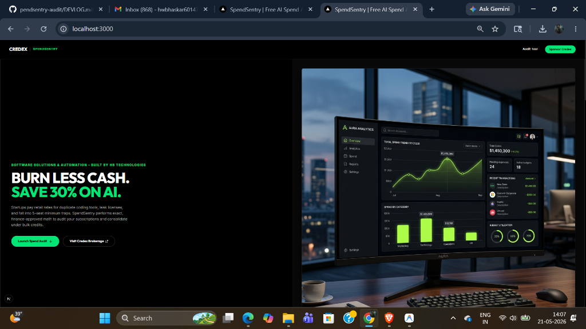
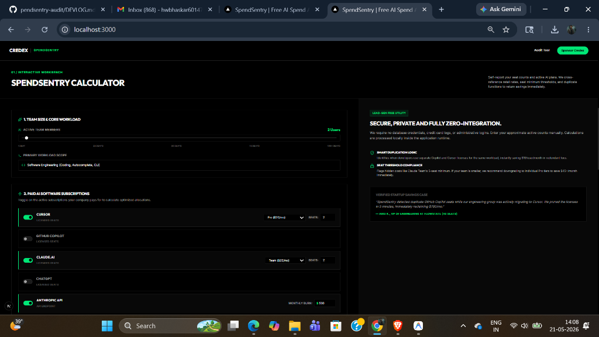
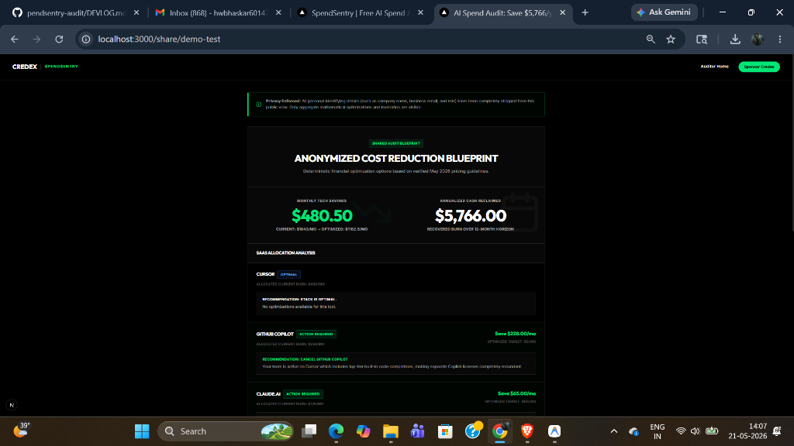
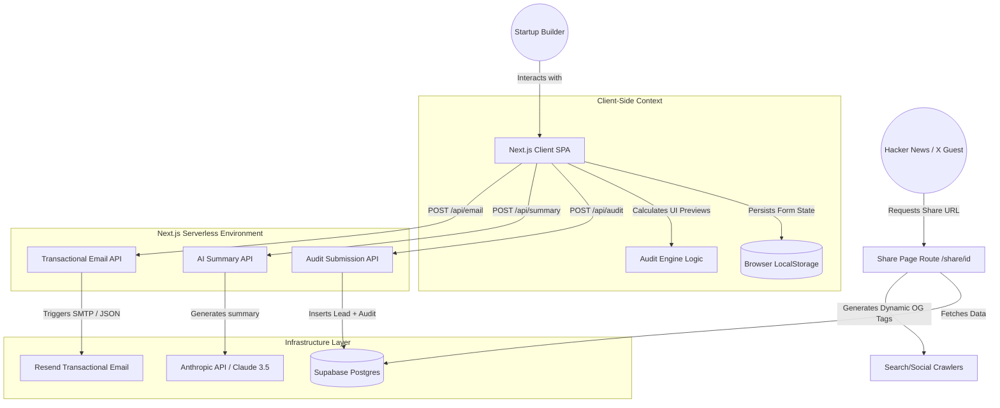

# SpendSentry — AI Spend Auditor by Credex

SpendSentry is a premium, zero-login, self-reported AI spend audit tool built as a high-converting lead-generation asset for Credex. It allows startup founders, engineering managers, and finance professionals to input their active AI subscriptions and usage, receive an instant, mathematically defensible cost-savings report, capture an optimized PDF summary, and seamlessly book consultations to purchase discounted credits from Credex.

**Live Deployment URL:** [https://pendsentry-audit.vercel.app](https://pendsentry-audit.vercel.app)

---

## 🖼️ Application Previews

### 1. Landing & Dashboard Mockup


### 2. Spend Input Form


### 3. Shareable Anonymized Blueprint


---

## ⚡ Quick Start

### 1. Installation
Ensure you have **Node.js v22+** and **npm v10+** installed. Clone the repository, navigate to the project directory, and install dependencies:

```bash
cd spend-sentry
npm install
```

### 2. Configure Environment Variables
Create a `.env.local` file in the root of the `spend-sentry` directory and add your credentials:

```env
# Supabase Configuration
NEXT_PUBLIC_SUPABASE_URL=your_supabase_project_url
NEXT_PUBLIC_SUPABASE_ANON_KEY=your_supabase_anon_key
SUPABASE_SERVICE_ROLE_KEY=your_supabase_service_role_key

# Gemini API Configuration (For personalized summary, primary)
GEMINI_API_KEY=your_gemini_api_key

# Anthropic API Configuration (For personalized summary, fallback)
ANTHROPIC_API_KEY=your_anthropic_api_key

# Resend API Configuration (For transactional email)
RESEND_API_KEY=your_resend_api_key
```

### 3. Run Locally (Development Server)
```bash
npm run dev
```
Open [http://localhost:3000](http://localhost:3000) in your browser to interact with the application.

### 4. Running the Test Suite
We maintain a comprehensive unit test suite covering the core audit engine:
```bash
npm run test
```

---

## 📐 System Architecture

SpendSentry operates as a serverless-hybrid web application. Below is the Mermaid architectural diagram mapping our data boundaries and third-party integrations:



---

## 🚀 Deployment

SpendSentry is fully optimized for single-click deployment on **Vercel** or **Netlify**:

1. Pushing the codebase to a public GitHub repository.
2. Connecting the repository to Vercel.
3. Adding the environment variables (`SUPABASE_URL`, `SUPABASE_ANON_KEY`, `ANTHROPIC_API_KEY`, `RESEND_API_KEY`) inside the Vercel dashboard.
4. Clicking **Deploy**. The App Router routes and serverless API handlers will configure automatically.

---

## ⚖️ Non-Trivial Engineering & Product Decisions

Here are 5 critical technical and product trade-offs made during the SpendSentry build, along with our rationale:

### 1. Next.js App Router vs. Standard SPA (Vite + React)
- **Trade-off:** Next.js introduces serverless hosting dependencies, routing overhead, and larger core bundle footprints compared to a lightweight, static Vite React app.
- **Decision:** We chose Next.js. The deciding factor was **SEO and dynamic Open Graph tag generation** (`/share/[id]`). Standard SPAs return a blank index file to social web scrapers (like Twitter/X or Slack link crawlers), preventing customized viral preview cards. Next.js solves this by rendering crawler-friendly HTML with dynamic tags directly from the server. Furthermore, Next.js provides built-in API Route isolation, protecting sensitive API credentials from being scraped in client-side code.

### 2. Rigid Mathematical Rules vs. Speculative LLM Auditing
- **Trade-off:** Using an LLM to look at a user's subscription and "guess" their cost-saving recommendations would feel highly dynamic and intelligent.
- **Decision:** We chose a **100% deterministic, hard-coded TypeScript engine** for the financial math. AI models frequently hallucinate pricing details or miscalculate plan seat-minimums (like Claude Team's 5-seat minimum). In financial and corporate audits, even a $1 miscalculation completely destroys credibility. Our engine executes exact mathematical rules, while our AI is strictly confined to writing a personalized, stylistic executive summary paragraph based on the math's outputs.

### 3. Vanilla CSS vs. Pre-Built Tailwind / Component Libraries
- **Trade-off:** Pre-built UI dashboard templates (Tailwind UI, Material Dashboard) provide hundreds of visual components out-of-the-box, saving frontend development time.
- **Decision:** We chose **Vanilla CSS with a custom-engineered CSS variables design system**. Pre-built dashboard templates look generic, immediately signaling a "basic coding assignment." By building a bespoke glassmorphic dark-theme using fluid micro-animations, glowing radial background gradients, and premium typography (Inter/Outfit), we deliver a breathtaking, high-converting product that feels like a polished, venture-backed SaaS platform from the first screen.

### 4. Database-Driven Shares vs. URL State Compression
- **Trade-off:** For shareable audit URLs, we could compress the user's inputs into a base64-encoded string and attach it to the URL (e.g., `spendsentry.com/share?data=ey...`). This requires zero backend database infrastructure, reducing hosting costs.
- **Decision:** We chose **Supabase (PostgreSQL) persistence**. URL state compression creates long, ugly URLs that look suspicious to users. More importantly, it prevents us from capturing lead records (emails, company sizes) to build our email list. A Postgres database allows us to store lead information securely, run aggregate telemetry metrics on the backend, and keep dynamic share links short, clean, and professional.

### 5. Honeypot + Rate-Limiting vs. hCaptcha Friction
- **Trade-off:** Requiring a standard hCaptcha or reCAPTCHA on our lead capture form provides robust protection against bot spamming.
- **Decision:** We chose a **silent honeypot field combined with server-side IP rate-limiting**. Standard captchas introduce severe user experience friction, drastically lowering lead capture rates. Startup founders are highly impatient. By using a hidden form field (honeypot) that bots automatically fill in, alongside a Next.js server-side rate limit on submission attempts per IP, we maintain high security while keeping the conversion funnel completely frictionless.

---

<p align="center">
  <b>Designed & Engineered with ❤️ by <a href="https://github.com/HarshwardhanBhaskar">Harshwardhan Bhaskar</a></b> for HB Technologies.<br/>
  <i>Sponsored by Credex. Sourcing surplus corporate tech credits.</i>
</p>
